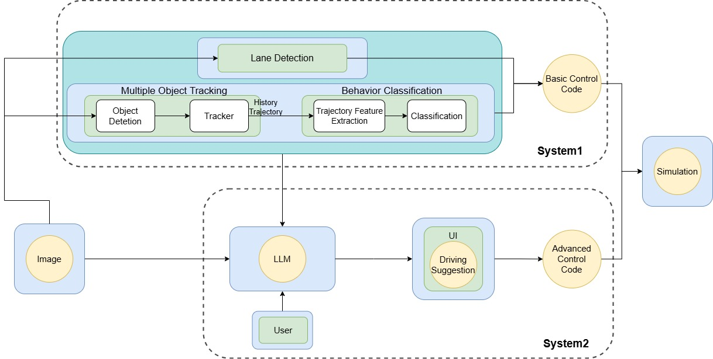

# FastSlowDrive

本專案是一套整合多種模組的智慧自駕系統，具備以下功能：
- 車輛與行人偵測與追蹤（YOLOv10 + ByteTrack）
- 車道線偵測與偏移控制（UFLD + PID 控制）
- 危險行為辨識（Social LSTM 軌跡分析）
- 語意駕駛建議生成（OpenAI GPT 模型）
- 支援 CARLA 模擬平台進行場景測試

## 📌 系統架構

## 🔧 專案目錄結構

| 檔案 / 資料夾        | 功能說明 |
|---------------------|----------|
| `MOT_v16.py`        | 系統主程式：整合感知、追蹤、控制、LLM 觸發 |
| `perception.py`     | 感知模組：多物件追蹤 + 車道線偵測 |
| `utils.py`          | 輔助函式：視窗截圖、危險區域推估、計時器等 |
| `visualization.py`  | 畫面渲染：軌跡繪製、車道線、風險區域顯示 |
| `control.py`        | 控制模組：PID 控制器、避障邏輯、車道維持 |
| `integration.py`    | GPT 模型整合：提示詞設計、API 呼叫與回應處理 |
| `social_lstm_trainer3.py` | 行為分類：Social-LSTM 模型進行軌跡分析 |
| `gui_app.py`        | 互動式 UI（選用） |

- Python >= 3.8
- [YOLOv10](https://github.com/ultralytics/ultralytics)
- [UFLD 車道線偵測](https://github.com/cfzd/Ultra-Fast-Lane-Detection)
- OpenAI API 金鑰
- [CARLA Simulator](https://carla.org/) 版本 0.9.13
- 其他套件詳見 `requirements.txt`（建議建立虛擬環境）

## 🚀 執行方式
1. 啟動 CARLA 模擬器
2. 啟動車流與行人腳本  
3. 執行主程式：

